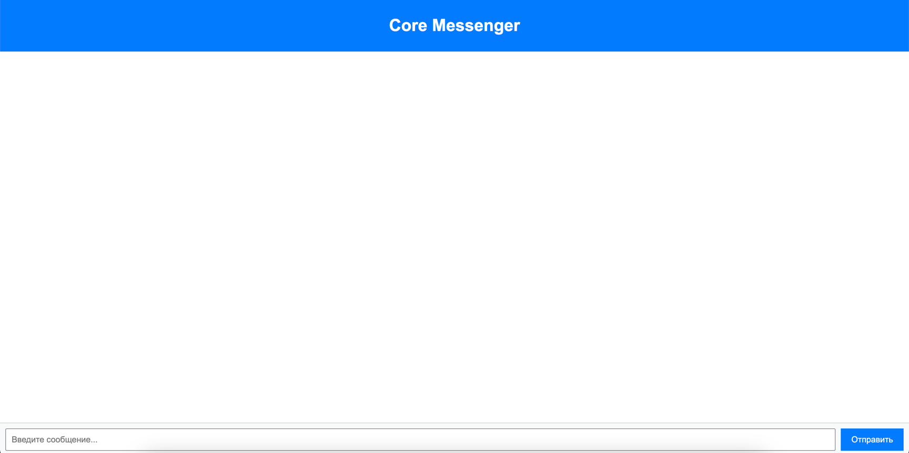
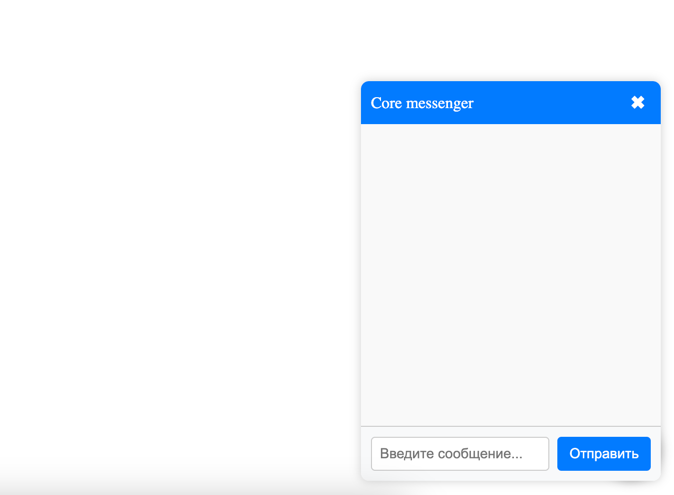

# Core messenger

Проект представляет собой ядро-движок, реализующее базовую функциональность для работы с чатами: 
создание, удаление, сохранение сообщений, уведомления о прочтении и другое. Это универсальное решение 
позволяет надстраивать над ним различные типы мессенджеров, адаптируя его под конкретные нужды.

Основная ценность продукта — в возможности быстро интегрировать готовую логику чатов в любую систему. 
Пользователю не нужно с нуля разрабатывать базовые функции. Он может использовать движок «как есть»,
включить в поставку Light messenger реализацию на бэкенде и Light UI на фронтенде, либо реализовать 
свою собственную бизнес-логику на базе ядра-движка (Core service) чатов, если это необходимо для его конкретного решения.

## Визуальная схема фронтенда

### Веб версия

### Виджет закрытый

### Виджет открытый

## Документация

1. Маркетинг и аналитика
    1. [Целевая аудитория](./docs/01-biz/01-target-audience.md)
    2. [Заинтересанты](./docs/01-biz/02-stakeholders.md)
    3. [Пользовательские истории](./docs/01-biz/03-bizreq.md)
2. Аналитика:
    1. [Функциональные требования](./docs/02-analysis/01-functional-requiremens.md)
    2. [Нефункциональные требования](./docs/02-analysis/02-nonfunctional-requirements.md)
3. Архитектура
    1. [ADR](docs/03-architecture/01-adrs.md)
    2. [Описание API](docs/03-architecture/02-api.md)
    3. [Архитектурные схемы](docs/03-architecture/03-arch.md)
4. DevOps
    1. [Файлы сборки](./deploy)
5. Тестовые сценарии
   1. [Tests list](docs/05-testing/tests-list.md)